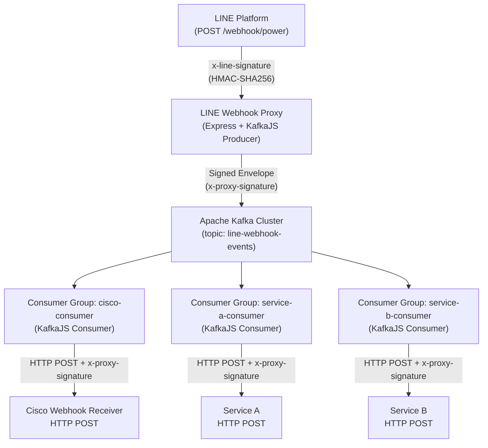
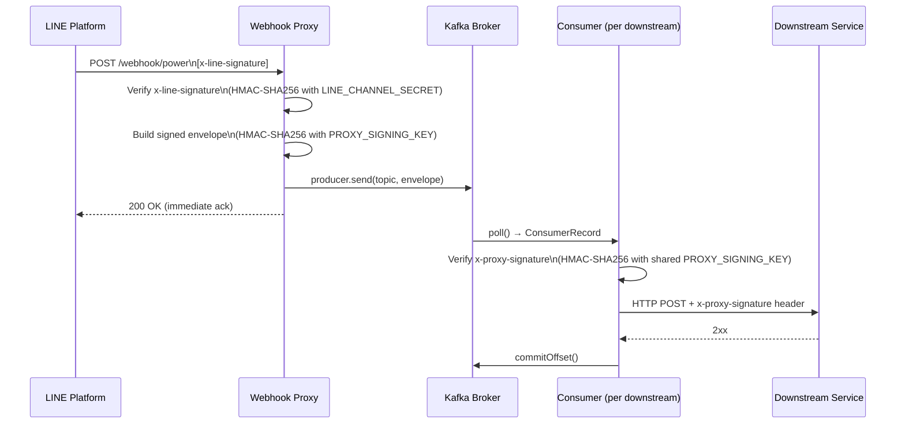
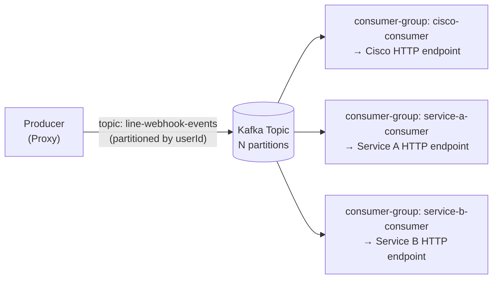
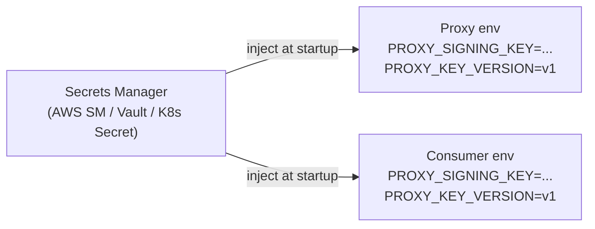
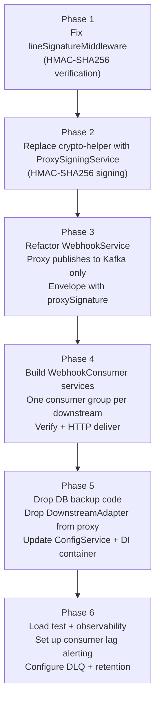

# Design Document: Kafka Webhook Migration

## Overview

Migrate the LINE Webhook Proxy from a synchronous HTTP fan-out model to a full Kafka-based event pipeline. The proxy ingests LINE events, publishes them to Kafka with a proxy-signed envelope (HMAC-SHA256), and independent consumer services pull and deliver those events to their own downstream targets. This eliminates the DB backup requirement (Kafka log retention provides durability), decouples the proxy from each downstream's availability, and introduces a proper proxy-origin signing mechanism that replaces both the XOR cipher and the raw LINE Channel Secret forwarding.

The migration covers four interconnected concerns: (1) hardening the inbound LINE signature check, (2) replacing the fan-out HTTP adapter with a Kafka producer, (3) designing a topic + consumer-group topology, and (4) implementing a proxy-signing contract that consumers use instead of the LINE Channel Secret.

---

## Architecture

### High-Level System Diagram



### Request Flow (Step by Step)



---

## Components and Interfaces

### Component 1: LineSignatureMiddleware (hardened)

**Purpose**: Verify that the inbound POST genuinely originates from LINE by computing HMAC-SHA256 over the raw body and comparing to `x-line-signature`. Currently only checks header presence — this must be fixed.

**Interface**:

```typescript
// src/api/middlewares/line-signature.middleware.ts
function lineSignatureMiddleware(
  req: Request,
  res: Response,
  next: NextFunction
): void
```

**Responsibilities**:
- Read raw body bytes (already captured as `req.rawBody` via express.json `verify`)
- Compute `HMAC-SHA256(LINE_CHANNEL_SECRET, rawBody)`, Base64-encode result
- Constant-time compare with `req.headers['x-line-signature']`
- Call `next(new UnauthorizedError(...))` on mismatch
- Skip HMAC only in `NODE_ENV !== 'production'` (preserve existing dev bypass)

---

### Component 2: KafkaProducerAdapter (new / replaces fan-out)

**Purpose**: The sole outbound adapter in the proxy. Publishes a signed `WebhookEnvelope` message to Kafka. All downstream HTTP delivery is handled by consumers.

**Interface**:

```typescript
// src/infrastructures/adapters/kafka-producer.adapter.ts
interface IKafkaProducerAdapter {
  publish(envelope: WebhookEnvelope): Promise<void>
}

class KafkaProducerAdapter implements IKafkaProducerAdapter {
  constructor(
    private readonly producer: Producer,
    private readonly topic: string,
    private readonly signingService: ProxySigningService
  )
  async publish(envelope: WebhookEnvelope): Promise<void>
}
```

**Responsibilities**:
- Build a `WebhookEnvelope` from raw body + inbound headers
- Delegate HMAC signing to `ProxySigningService`
- Call `producer.send()` with the envelope as the Kafka message value (JSON)
- Kafka message `key` = `userId` (extracted from LINE events) for partition affinity (ordering per user)

---

### Component 3: ProxySigningService (replaces crypto-helper)

**Purpose**: Generate and verify the proxy-origin HMAC-SHA256 signature. Replaces the XOR-based `crypto-helper.ts`.

**Interface**:

```typescript
// src/helpers/proxy-signing.service.ts
interface IProxySigningService {
  sign(payload: string): string           // returns Base64-encoded HMAC-SHA256
  verify(payload: string, sig: string): boolean
}

class ProxySigningService implements IProxySigningService {
  constructor(private readonly signingKey: string)
  sign(payload: string): string
  verify(payload: string, sig: string): boolean
}
```

**Signing algorithm**: `HMAC-SHA256` using Node's built-in `crypto` module. No new runtime dependencies needed.

**Key management**:
- Key stored in environment variable `PROXY_SIGNING_KEY` (minimum 32 bytes of entropy)
- Shared out-of-band with each consumer service via a secrets manager (e.g. AWS Secrets Manager, Vault, or Kubernetes Secrets)
- Key rotation: increment `PROXY_KEY_VERSION` env var; consumers accept signatures from `current - 1` version for a grace window

---

### Component 4: WebhookConsumer (new, runs in consumer services)

**Purpose**: A standalone consumer process (one per downstream service) that reads from Kafka, verifies the proxy signature, and HTTP-POSTs to its target.

**Interface**:

```typescript
// consumer/src/webhook-consumer.ts
interface IWebhookConsumer {
  start(): Promise<void>
  stop(): Promise<void>
}

class WebhookConsumer implements IWebhookConsumer {
  constructor(
    private readonly consumer: Consumer,       // KafkaJS Consumer
    private readonly topic: string,
    private readonly downstream: IDownstreamAdapter,
    private readonly signingService: IProxySigningService,
    private readonly groupId: string
  )
  async start(): Promise<void>
  async stop(): Promise<void>
}
```

**Responsibilities**:
- Subscribe with its own `groupId`
- For each message: deserialize `WebhookEnvelope`, verify `x-proxy-signature`
- Forward verified payload to its downstream via `DownstreamAdapter`
- Commit offset only after successful delivery (at-least-once semantics)
- Implement exponential back-off retry before committing failure

---

### Component 5: WebhookService (simplified)

**Purpose**: Orchestrates proxy flow — now only calls `KafkaProducerAdapter.publish()` instead of fan-out over multiple HTTP adapters.

**Interface**:

```typescript
// src/application/webhook/webhook.service.ts
class WebhookService {
  constructor(private readonly kafkaProducer: IKafkaProducerAdapter)
  async forward(rawBody: string, headers: IncomingHttpHeaders): Promise<void>
}
```

**Note**: `WebhookForwardModel` is no longer needed in the proxy; delivery results live in consumer-side logs.

---

## Data Models

### WebhookEnvelope (Kafka message value)

```typescript
interface WebhookEnvelope {
  // Routing & identity
  envelopeId: string           // UUID v4 — idempotency key
  version: string              // envelope schema version, e.g. "1"
  proxyKeyVersion: string      // signing key version for rotation support

  // Payload
  lineEventType: string        // e.g. "message", "follow", "unfollow"
  userId: string | null        // LINE userId (used as Kafka partition key)
  rawBody: string              // original JSON string from LINE

  // Provenance
  receivedAt: string           // ISO 8601 UTC timestamp
  proxySignature: string       // HMAC-SHA256(PROXY_SIGNING_KEY, rawBody) — Base64

  // Preserved inbound headers (selective subset — NOT x-line-signature)
  inboundHeaders: {
    'x-request-id'?: string
    'x-forwarded-for'?: string
    'content-type'?: string
  }
}
```

**Why `rawBody` as string**: Consumers need the exact bytes to re-verify the proxy signature and to forward to their downstream without re-serialization drift.

**What is NOT included**: `x-line-signature` and `LINE_CHANNEL_SECRET` are never embedded in the envelope. Consumers have no path to the LINE credential.

---

### Updated ConfigService shape

```typescript
interface KafkaProducerConfig {
  enabled: boolean
  brokers: string[]
  topic: string
  clientId: string
  compressionType?: 'gzip' | 'snappy' | 'lz4'  // optional, default none
}

interface KafkaConsumerConfig {
  groupId: string
  brokers: string[]
  topic: string
  sessionTimeoutMs: number        // default 30000
  heartbeatIntervalMs: number     // default 3000
  maxBytesPerPartition: number    // default 1048576 (1 MB)
  retry: {
    initialRetryTime: number      // default 300ms
    retries: number               // default 8
  }
}

interface ProxySigningConfig {
  signingKey: string              // from PROXY_SIGNING_KEY env var
  keyVersion: string              // from PROXY_KEY_VERSION env var
}
```

New environment variables needed:

```
PROXY_SIGNING_KEY=<base64-encoded 32+ byte secret>
PROXY_KEY_VERSION=v1
# Consumer-side only:
KAFKA_GROUP_ID=cisco-consumer
DOWNSTREAM_URL=https://cisco-target.example.com/webhook
DOWNSTREAM_TIMEOUT_MS=5000
```

---

## Topic and Consumer Group Strategy

### Recommendation: Single Shared Topic + Separate Consumer Group per Downstream



Each consumer group maintains its own committed offset cursor, so every group sees every message independently — this is Kafka's native broadcast/fan-out model. Adding a new downstream requires only creating a new consumer group and pointing it at the same topic; no producer changes needed.

### Trade-off Analysis

#### Option A: Single Topic + Separate Consumer Group per Downstream ✅ Recommended

| Dimension | Detail |
|-----------|--------|
| **Fan-out** | Each group receives every message independently via independent offset tracking |
| **Failure isolation** | Cisco consumer crashing does NOT block Service A or B; each group's lag is independent |
| **Ordering** | Per-userId ordering preserved (Kafka partition key = userId); each group processes in same partition order |
| **Scaling** | Each group can scale consumers independently up to partition count |
| **Operations** | Single topic to monitor; consumer lag per group clearly visible in tooling (Kafka UI, Confluent Control Center) |
| **Adding downstreams** | Zero producer changes — deploy a new consumer group |
| **Partition count** | Must be set to `max(expected concurrent consumers across all groups)` or at least `max_consumers_in_any_single_group` |
| **Limitation** | All downstreams receive all LINE event types; filtering must happen inside consumers |

#### Option B: Fan-out Topics (one topic per downstream)

| Dimension | Detail |
|-----------|--------|
| **Fan-out** | Proxy must publish to each topic explicitly (N `producer.send()` calls) |
| **Failure isolation** | Good — a slow consumer topic does not affect others |
| **Ordering** | Same per-partition guarantee |
| **Scaling** | Independent partition counts per topic |
| **Operations** | N topics to manage, monitor, and set retention on |
| **Adding downstreams** | Requires proxy code change to add a new topic publish |
| **Best use case** | When downstreams need drastically different retention, replication, or schema |
| **Limitation** | Proxy becomes aware of individual downstreams — tight coupling reintroduced |

#### Option C: Single Topic + Single Merged Consumer Group

| Dimension | Detail |
|-----------|--------|
| **Fan-out** | **No fan-out** — only one consumer (or one scaling group) gets each message. Not suitable for this use case. |
| **Failure isolation** | A single consumer crash blocks all downstreams until rebalance |
| **Ordering** | Preserved within partitions |
| **Use case** | Logging, audit trail, aggregated analytics — NOT multi-downstream delivery |
| **Verdict** | ❌ Not applicable for this architecture |

### Partition Key and Ordering

- **Partition key**: `userId` (extracted from LINE event `events[0].source.userId`)
- All events for the same LINE user land on the same partition
- All consumer groups read that partition in the same offset order — ordering per user is consistent across all downstreams
- If `userId` is null (e.g., broadcast messages), fall back to `envelopeId` as key to spread load

### Recommended Partition Count

Start with **6–12 partitions** for `line-webhook-events`. Rule: `partitions ≥ max consumers in any single group × safety_factor(1.5)`. Partitions cannot be reduced after creation — over-provision slightly.

---

## Proxy-Signing Mechanism (Security Design)

### Problem Statement

Currently:
1. `lineSignatureMiddleware` checks only header presence, not the HMAC — **no verification at all in production**
2. `crypto-helper.ts` uses XOR cipher — trivially reversible, not cryptographically secure
3. Downstream consumers receive the raw `x-line-signature` and would need `LINE_CHANNEL_SECRET` to validate origin — secret leakage risk

### Solution: HMAC-SHA256 Proxy Signature

#### Why HMAC-SHA256 over AES-256-GCM

| Criterion | HMAC-SHA256 | AES-256-GCM |
|-----------|-------------|-------------|
| **Purpose** | Message authentication (integrity + origin) | Encryption (confidentiality) |
| **Fit** | ✅ Perfect — we need to prove the proxy sent this, not hide the payload | ⚠️ Overkill — consumers need to read the payload, not decrypt secrets |
| **Performance** | Very fast — single-pass keyed hash | Slower — requires IV generation, GCM tag computation |
| **Industry standard** | Used by Stripe, GitHub, LINE, Svix for webhook signing | Better suited for secret storage, not payload authentication |
| **Node.js support** | Built-in `crypto.createHmac` | Built-in `crypto.createCipheriv`, more complex API |
| **Key compromise** | Rotate `PROXY_SIGNING_KEY`, re-share with consumers | Same key rotation needed |

**Verdict**: HMAC-SHA256 is the correct tool for message authentication. AES-256-GCM is for encryption. This is an authentication problem.

#### Signing Algorithm

```typescript
// ProxySigningService — signing
import { createHmac, timingSafeEqual } from 'crypto'

function sign(rawBody: string, key: string): string {
  return createHmac('sha256', key)
    .update(rawBody, 'utf8')
    .digest('base64')
}

// ProxySigningService — verification (constant-time comparison)
function verify(rawBody: string, receivedSig: string, key: string): boolean {
  const expected = createHmac('sha256', key)
    .update(rawBody, 'utf8')
    .digest()
  const received = Buffer.from(receivedSig, 'base64')
  if (expected.length !== received.length) return false
  return timingSafeEqual(expected, received)  // prevents timing attacks
}
```

#### Proxy Signature Header Contract

The proxy embeds the signature in the Kafka envelope as `proxySignature`. When the consumer HTTP-POSTs to its downstream, it forwards:

```
x-proxy-signature: v1=<base64-HMAC-SHA256>
x-proxy-key-version: v1
x-envelope-id: <uuid>
```

The downstream (e.g., Cisco) verifies `HMAC-SHA256(PROXY_SIGNING_KEY, rawBody)` matches `x-proxy-signature`. They **never** see `LINE_CHANNEL_SECRET`.

#### Key Management



- Proxy and all consumer services read the key from the same secret store at startup
- `PROXY_KEY_VERSION` enables graceful rotation: consumer accepts `v1` and `v2` simultaneously during a rollover window, then retires `v1`
- Key minimum: 32 bytes (256 bits), generated via `openssl rand -base64 32`

#### Inbound LINE Signature Fix

```typescript
// Correct lineSignatureMiddleware implementation
const channelSecret = configService.getLineConfig().channelSecret
const rawBody = (req as any).rawBody as string
const expectedSig = createHmac('sha256', channelSecret)
  .update(rawBody, 'utf8')
  .digest('base64')
const actualSig = req.headers['x-line-signature'] as string

if (!timingSafeEqual(
  Buffer.from(expectedSig),
  Buffer.from(actualSig ?? '')
)) {
  return next(new UnauthorizedError({ code: ErrorCode.SIGNATURE_INVALID, message: 'Invalid x-line-signature' }))
}
```

---

## Open-Source Webhook Proxy Research

### Evaluated Solutions

| Platform | License | Active | Key Patterns | Relevance to This System |
|----------|---------|--------|--------------|--------------------------|
| **Svix** | MIT (open-source server) | ✅ Yes | At-least-once delivery, HMAC-SHA256 per endpoint, retries with exponential backoff, consumer portal, FIFO ordering, event replay | Most mature; our signing design mirrors Svix's per-endpoint secret model |
| **Hookdeck Outpost** | Apache 2.0 | ✅ Yes | Event Gateway pattern, OpenTelemetry on every tier, multi-destination native delivery, circuit breaking | Circuit-breaker concept applicable to consumer retry logic |
| **Convoy** | Elastic License v2 | ⚠️ Maintenance mode (company wound down) | Unified send+receive gateway, embedded dashboards | Avoid as dependency; architecture patterns still relevant |
| **Hook0** | AGPL | ✅ Small team | Simple EU-focused, basic management UI | Low relevance for this scale |
| **Webhook Relay** | Proprietary | ✅ Yes | Developer tooling and forwarding, not customer-facing outbound at scale | Not applicable |

### Patterns Adopted from Open-Source Tools

1. **Signed envelopes with key versioning** (from Svix): Every message carries `x-proxy-signature: v1=<hmac>` and `x-proxy-key-version: v1`. Consumers verify before processing.

2. **At-least-once delivery with idempotency keys** (from Svix/Hookdeck): Each envelope carries a UUID `envelopeId`. Consumer downstream must implement idempotent processing using this key.

3. **Exponential backoff retry in consumers** (from Svix): On delivery failure, retry schedule: 5s → 30s → 2m → 10m → 1h, cap at 5 attempts, then dead-letter.

4. **Dead-letter pattern** (from Convoy/Hookdeck): Failed envelopes after max retries are published to `line-webhook-events-dlq` topic for manual inspection and replay.

5. **Circuit-breaker per downstream** (from Hookdeck): Consumer tracks consecutive failures per downstream; if threshold exceeded, backs off entirely for a configured window rather than hammering a degraded service.

6. **Event replay via Kafka offset reset** (from Svix replay concept): Unlike a DB backup, Kafka retention (configurable, e.g., 7 days) allows a new consumer group to replay all events from the beginning. This directly replaces the DB backup requirement.

---

## Error Handling

### Error Scenario 1: Invalid LINE Signature (Inbound)

**Condition**: `x-line-signature` missing or HMAC mismatch  
**Response**: `401 Unauthorized` — proxy rejects immediately, nothing published to Kafka  
**Recovery**: No action needed; LINE will not retry unless the integration is misconfigured

### Error Scenario 2: Kafka Producer Failure

**Condition**: Kafka broker unreachable or `producer.send()` throws  
**Response**: Proxy returns `503 Service Unavailable` to LINE after internal retry (KafkaJS built-in retry)  
**Recovery**: LINE Messaging API retries webhook delivery on non-2xx; events are not lost

### Error Scenario 3: Consumer Downstream Failure (HTTP 4xx/5xx or timeout)

**Condition**: Downstream service returns error or times out  
**Response**: Consumer retries with exponential backoff (up to 5 attempts)  
**Recovery**: After max retries, envelope is published to `line-webhook-events-dlq`; offset NOT committed until delivery confirmed or DLQ write confirmed

### Error Scenario 4: Invalid Proxy Signature (Consumer Side)

**Condition**: Consumer verifies `proxySignature` and it does not match  
**Response**: Consumer logs a security alert and discards the message (commits offset to avoid infinite loop)  
**Recovery**: Investigate message tampering or key rotation race condition; replay from DLQ after key verification

### Error Scenario 5: Consumer Group Rebalance Mid-Processing

**Condition**: Consumer instance leaves group while processing a message  
**Response**: KafkaJS `eachMessage` with manual offset commit ensures uncommitted offsets are re-assigned to another consumer instance  
**Recovery**: Downstream must handle duplicate delivery idempotently using `envelopeId`

---

## Testing Strategy

### Unit Testing Approach

Test each component in isolation:
- `ProxySigningService`: sign/verify round-trip; verify rejects tampered payloads; constant-time compare does not throw
- `lineSignatureMiddleware`: valid signature passes; missing header returns 401; tampered body returns 401
- `KafkaProducerAdapter`: mock `producer.send()`, verify envelope structure and signature presence
- `WebhookConsumer`: mock KafkaJS consumer and downstream adapter; verify retry logic and DLQ publish on failure

**Recommended test framework**: `vitest` (zero-config TypeScript, compatible with existing project structure)

### Property-Based Testing Approach

**Property Test Library**: `fast-check`

Key properties to verify:
- For all `(rawBody: string, key: string)`: `verify(rawBody, sign(rawBody, key), key) === true`
- For all `(rawBody: string, key: string, tamperedBody: string)` where `tamperedBody ≠ rawBody`: `verify(tamperedBody, sign(rawBody, key), key) === false`
- For all valid envelopes: `deserialize(serialize(envelope))` deep-equals original envelope
- Partition key assignment: all events with the same `userId` produce the same Kafka partition key

### Integration Testing Approach

- Use `testcontainers` to spin up a real Kafka broker in CI
- Producer → real Kafka → consumer pipeline end-to-end
- Verify signature round-trip with real `PROXY_SIGNING_KEY`
- Verify offset commit only after downstream mock returns 2xx
- Verify DLQ receives envelope after 5 failed delivery attempts

---

## Performance Considerations

- **Proxy latency**: Publishing to Kafka is fire-and-forget from LINE's perspective. The proxy returns 200 as soon as `producer.send()` resolves (~1–5ms to broker ACK with `acks: 1`). This is faster than the current synchronous HTTP fan-out.
- **Consumer throughput**: Each consumer group scales horizontally by adding instances (up to partition count). Start with 1 instance per group; add more if lag accumulates.
- **Partition count**: 6–12 partitions is sufficient for typical LINE webhook volumes. Revisit if events/sec exceeds `partitions × consumer_throughput`.
- **Message size**: LINE event payloads are small (< 2 KB typically). Kafka default max message size (1 MB) is not a concern.
- **Compression**: Enable `gzip` or `snappy` on the producer if broker disk usage becomes a concern.

---

## Security Considerations

| Threat | Mitigation |
|--------|-----------|
| Spoofed LINE events | Full HMAC-SHA256 verification of `x-line-signature` (replacing current header-presence-only check) |
| LINE credential leakage to consumers | `LINE_CHANNEL_SECRET` never placed in Kafka messages; consumers authenticate via `PROXY_SIGNING_KEY` only |
| Replay attacks (Kafka envelope) | `envelopeId` (UUID) + `receivedAt` timestamp in envelope; consumers can implement idempotency store (Redis/DB) to reject duplicates if needed |
| Proxy signing key exposure | Key injected via secrets manager at runtime; not in source code or logs |
| Timing side-channel on signature compare | `crypto.timingSafeEqual` used for all HMAC comparisons |
| Insecure XOR cipher | `crypto-helper.ts` replaced by `ProxySigningService`; XOR functions deleted |
| Kafka broker access | Kafka should be on a private network; SASL/SCRAM or mTLS for broker auth in production |
| Consumer-to-downstream MITM | Downstream endpoints should be HTTPS; consumer validates TLS certificates |

---

## Dependencies

### Existing (no changes needed)
- `kafkajs ^2.2.4` — producer + consumer
- `express ^4.18.0`
- `axios ^1.7.0` — still used in consumer's `DownstreamAdapter`
- Node.js built-in `crypto` — replaces `crypto-helper.ts` for HMAC-SHA256

### New (to add)
- `uuid ^9.0.0` — generate `envelopeId` (UUIDv4) — lightweight, zero native deps
- `vitest ^1.0.0` (devDependency) — test runner
- `fast-check ^3.0.0` (devDependency) — property-based testing
- `@testcontainers/kafka ^10.0.0` (devDependency) — integration test Kafka

### Removed
- DB-related dependencies (if any were used for event backup storage)
- `crypto-helper.ts` (XOR cipher) — deleted entirely

---

## Correctness Properties

These properties define invariants that must hold throughout the system. Properties marked **PBT** are amenable to property-based testing with `fast-check`.

### Property 1: HMAC Round-Trip

**Type**: PBT (property-based)  
**Validates: Requirements 1.1** (Proxy-signing mechanism correctness)  
For all `rawBody: string` and `key: string` (non-empty), signing then verifying must always return true:

```typescript
// ∀ rawBody, key: sign then verify returns true
const sig = proxySigningService.sign(rawBody)
assert(proxySigningService.verify(rawBody, sig) === true)
```

### Property 2: Tamper Detection

**Type**: PBT (property-based)  
**Validates: Requirements 1.2** (Signature must reject tampered payloads)  
For all `rawBody: string`, `tamperedBody: string` where `tamperedBody ≠ rawBody`, the original signature must not verify against the tampered body:

```typescript
// ∀ rawBody ≠ tamperedBody: signature of rawBody does NOT verify against tamperedBody
const sig = proxySigningService.sign(rawBody)
assert(proxySigningService.verify(tamperedBody, sig) === false)
```

### Property 3: Envelope Serialization Round-Trip

**Type**: PBT (property-based)  
**Validates: Requirements 2.1** (Envelope schema integrity)  
For all valid `WebhookEnvelope` objects, serializing then deserializing produces an identical value:

```typescript
// ∀ envelope: deserialize(serialize(envelope)) deep-equals envelope
const serialized = JSON.stringify(envelope)
const deserialized = JSON.parse(serialized) as WebhookEnvelope
assert(deepEqual(deserialized, envelope) === true)
```

### Property 4: No Credential Leakage in Envelope

**Type**: PBT (property-based)  
**Validates: Requirements 1.3** (LINE_CHANNEL_SECRET must not be exposed to consumers)  
For all produced `WebhookEnvelope` values, the serialized form must not contain `LINE_CHANNEL_SECRET` or `x-line-signature`:

```typescript
// ∀ envelope: serialized JSON must not contain LINE credentials
const serialized = JSON.stringify(envelope)
assert(serialized.includes(LINE_CHANNEL_SECRET) === false)
assert(serialized.includes('x-line-signature') === false)
```

### Property 5: Partition Key Consistency

**Type**: PBT (property-based)  
**Validates: Requirements 3.1** (Ordering guarantee — same userId maps to same partition key)  
For all messages with the same `userId`, the derived Kafka partition key must be identical:

```typescript
// ∀ userId: partitionKey(event1, userId) === partitionKey(event2, userId)
assert(derivePartitionKey(envelope1) === derivePartitionKey(envelope2))  // same userId
```

### Property 6: Retry Schedule Correctness

**Type**: Example  
**Validates: Requirements 4.1** (Consumer exponential back-off retry on delivery failure)  
The consumer retry delay for attempt `n` must follow exponential back-off capped at 60 seconds:

```typescript
// delays: 300ms, 600ms, 1200ms, 2400ms, 4800ms (cap at 60000ms)
assert(retryDelay(0) === 300)
assert(retryDelay(1) === 600)
assert(retryDelay(4) === 4800)
assert(retryDelay(10) === 60000)  // capped
```

### Property 7: Dead-Letter on Max Retries

**Type**: Example  
**Validates: Requirements 4.2** (DLQ receives failed envelopes after max retries exhausted)  
After exactly `maxRetries` consecutive delivery failures, the envelope is published to the DLQ and the offset is committed exactly once:

```typescript
// Simulate maxRetries failures → DLQ publish called once, offset committed once
const consumer = buildTestConsumer({ maxRetries: 3 })
await consumer.processMessage(envelope, failingDownstream)
assert(dlqPublishCallCount === 1)
assert(offsetCommitCallCount === 1)
assert(downstreamCallCount === 3)
```

### Property 8: Invalid Proxy Signature Rejected

**Type**: Example  
**Validates: Requirements 1.4** (Consumer must reject envelopes with invalid proxy signatures)  
A consumer receiving an envelope with a mismatched `proxySignature` must discard the message and commit the offset without calling the downstream:

```typescript
const tamperedEnvelope = { ...envelope, rawBody: envelope.rawBody + 'x' }
await consumer.processMessage(tamperedEnvelope, downstream)
assert(downstreamCallCount === 0)
assert(securityAlertLogCount === 1)
assert(offsetCommitCallCount === 1)
```

---

## Migration Path



Each phase is independently deployable and testable. The proxy can run in hybrid mode during Phase 3–4 (both Kafka + HTTP fan-out active) to validate the consumer pipeline before cutting over.
